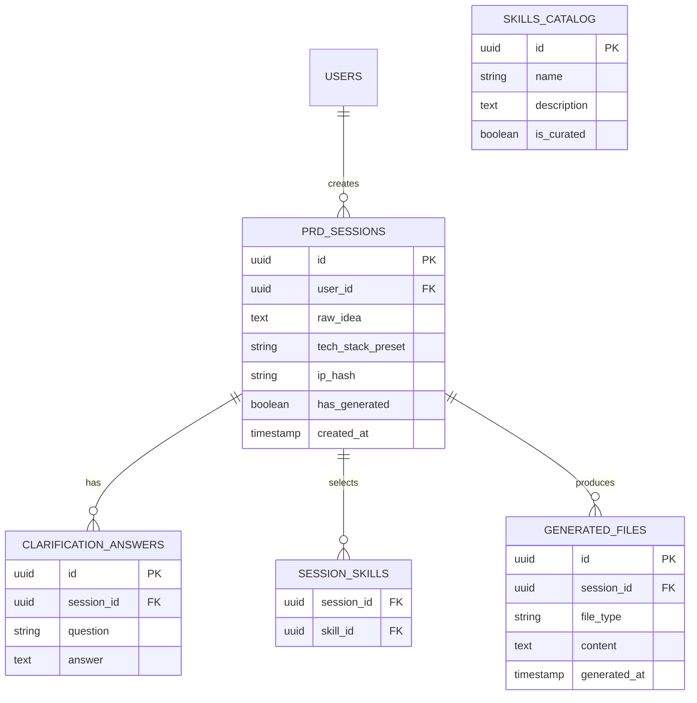
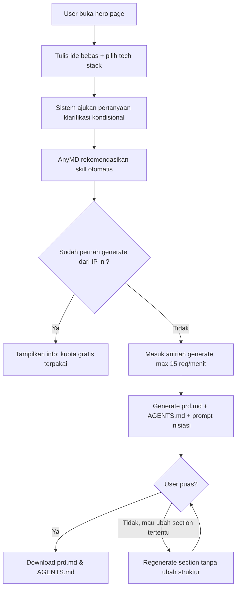
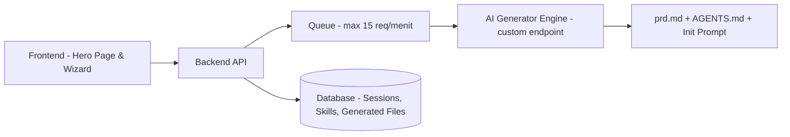

# Product Requirements Document (PRD)

**Nama Proyek:** AnyMD
**Dikembangkan oleh:** Maventlabs
**Lisensi:** Open Source
**Versi Dokumen:** v0.3
**Terakhir Diperbarui:** 18 September 2026
**Author:** Aditiya

---

## 1. Product Overview

**Deskripsi Produk:**
AnyMD adalah tool open source yang mengubah ide produk mentah (ditulis bebas dalam bahasa apapun) menjadi Product Requirements Document (PRD) yang komprehensif dan siap dikonsumsi langsung oleh AI coding agent (Claude Code, opencode, dan sejenisnya). Selain PRD, AnyMD juga menghasilkan teks prompt inisiasi singkat yang bisa langsung ditempel user ke agent untuk memulai eksekusi berdasarkan PRD tersebut.

**Problem Statement:**
Saat ini, membuat PRD yang benar-benar bisa "dipahami" dan dieksekusi dengan baik oleh AI coding agent masih manual dan tidak konsisten. Kebanyakan generator PRD yang ada menghasilkan dokumen generik untuk dibaca manusia (stakeholder, tim produk), bukan dokumen yang dioptimalkan agar agent coding bisa langsung bekerja dari situ — termasuk memanfaatkan MCP dan skill yang tersedia di environment mereka.

**Target User:**
Solo developer dan tim kecil yang membangun produk dengan bantuan AI coding agent, dan ingin proses dari "ide" ke "PRD siap eksekusi" berjalan cepat dan terstruktur tanpa harus menulis PRD manual dari nol.

**Catatan positioning:** PRD paling bernilai untuk proyek baru atau fitur besar multi-step yang menyentuh banyak bagian codebase — bukan untuk perubahan kecil (misal tambah 1 field form), yang lebih efisien dikerjakan lewat prompt langsung ke agent. AnyMD sebaiknya dikomunikasikan sebagai tool untuk fase awal proyek/fitur besar, bukan pengganti semua interaksi dengan coding agent.

**Non-Functional Requirements:**
- Target waktu generate: di bawah 90 detik (mengikuti benchmark tool sejenis)
- Output tetap 2 file (`prd.md` + `AGENTS.md`) — penambahan jenis file lain hanya atas permintaan eksplisit di iterasi mendatang, bukan default
- Panjang `prd.md` hasil generate: target 2.000-3.000 kata, hard cap 4.000 kata. Jumlah Fitur/Sub-fitur/Phase/Diagram bersifat adaptif (agent menentukan sendiri sesuai kompleksitas ide), bukan angka tetap — batasan yang dijaga adalah total panjang dokumen, bukan jumlah item.
- Input dan output mempertahankan Unicode dan bahasa dokumen yang dipilih user tanpa silent normalization loss.
- Setiap fitur, kontrol, dan integrasi yang ditulis ke output harus berfungsi end-to-end; placeholder dekoratif, dead button, fake interaction, dan simulated success dilarang.
- Antrian generate: maksimum 15 request/menit ke AI provider (default, dapat diubah maintainer — lihat Fitur 3A)
- Free tier: 1x generate gratis per IP; generate tambahan lewat sistem token (1 token = 1 generate, bukan langganan)

**Out of Scope (v1):**
- Tidak mengeksekusi kode — AnyMD hanya menghasilkan dokumen (PRD.md) dan teks prompt, bukan menjalankan agent secara langsung.
- Tidak menyimpan/mengelola histori proyek berkelanjutan (versioning PRD lintas waktu) di v1 — cukup generate sekali per sesi.
- Tidak menyediakan integrasi login/akun kompleks di v1 kecuali diperlukan untuk menyimpan preferensi skill user.

---

## 2. Unique Selling Proposition (USP)

> Analisis kompetitor (Keeborg, ChatPRD) menunjukkan "generate PRD dari ide" sudah jadi komoditas — beberapa kompetitor bahkan sudah menghasilkan 8 dokumen saling terhubung (PRD, architecture, OpenAPI spec, DB schema, dll) dengan export CLAUDE.md/.cursorrules otomatis. AnyMD perlu diferensiasi yang lebih tajam dari sekadar "generate dokumen".

- **Diferensiasi utama:** Instruksi eksplisit di PRD yang membuat agent mengecek skill yang benar-benar terinstal di environment user (bukan config generik), dan menyesuaikan cara kerja secara kondisional berdasarkan itu — belum ditemukan di kompetitor manapun saat riset ini dilakukan.
- **Kenapa ini penting bagi user:** Menghilangkan gap antara "punya ide" dan "PRD yang benar-benar actionable" — user tidak perlu tahu cara menulis PRD yang baik, cukup jawab pertanyaan klarifikasi yang diajukan sistem.
- **Kurasi skill hidup (living catalog), fetch live dari komunitas:** AnyMD tidak memakai daftar skill statis, melainkan fetch otomatis dari skills-vault (dengan `mattpocock/skills` sebagai prioritas), jadi katalog selalu mengikuti perkembangan skill terbaru tanpa perlu update kode AnyMD.
- **Open source & ringan, bukan mengejar jumlah fitur:** Alih-alih menghasilkan banyak dokumen terpisah seperti sebagian kompetitor, AnyMD tetap fokus pada dua file (`prd.md` + `AGENTS.md`) yang presisi dan cepat — cocok untuk solo dev yang tidak ingin over-engineered.
- **Data sovereignty:** Karena open source dan bisa di-self-host, ide produk user (yang berpotensi rahasia/kompetitif) tidak wajib melewati server pihak ketiga — user yang self-host mengontrol penuh di mana data mereka disimpan dan AI provider mana yang dipanggil. Untuk versi hosted resmi Maventlabs (kalau ada), sesi/ide user disimpan sementara dan tidak dipakai untuk melatih model AI apa pun tanpa izin eksplisit.

---

## 3. Fitur & Sub-Fitur

### Fitur 1: Input Ide Bebas
**Deskripsi:** Halaman awal (hero page) tempat user menuliskan ide produknya secara bebas, dalam bahasa apapun (utamanya English).
**Prioritas:** Must-have

Sub-fitur:
- **Text input bebas** — Textarea besar tanpa batasan format, mendukung multi-bahasa.
- **Deteksi bahasa otomatis** — Sistem mendeteksi bahasa input untuk keperluan proses internal (opsional: PRD akhir tetap konsisten dalam satu bahasa, misal English, meskipun input campur bahasa).
- **Pilihan tech stack modern (preset)** — Dropdown/checkbox di hero page untuk memilih stack awal yang akan mempengaruhi isi Tech Stack di PRD akhir. Lihat Section 5 untuk daftar kategori & opsi.
- **Contoh ide (starter examples)** — 3-4 contoh ide singkat berbasis teks statis (dikurasi internal AnyMD, bukan fetch dari sumber eksternal) yang bisa diklik user untuk auto-fill textarea sebagai inspirasi awal, mengatasi "halaman kosong" yang membingungkan user baru.

### Fitur 2: Klarifikasi Interaktif (Kondisional)
**Deskripsi:** Setelah ide awal masuk, sistem mengajukan pertanyaan lanjutan untuk memperdalam detail ide sebelum PRD disusun.
**Prioritas:** Must-have

Sub-fitur:
- **Pertanyaan inti (fixed)** — Beberapa pertanyaan wajib untuk semua jenis produk (problem, target user, platform, dll).
- **Pertanyaan kondisional (branching)** — Pertanyaan lanjutan menyesuaikan jawaban sebelumnya (misal: kalau user pilih "mobile app", muncul pertanyaan spesifik platform iOS/Android; kalau "web app", muncul pertanyaan browser target).
- **Total sekitar 10 pertanyaan** — Bisa kurang/lebih tergantung percabangan, bukan angka kaku.
- **Indikator kelengkapan (kecil)** — Elemen visual sederhana berbentuk garis/line progress (bukan skor besar atau dashboard), menunjukkan seberapa banyak informasi yang sudah terkumpul relatif terhadap estimasi total pertanyaan — cukup sebagai sinyal halus, tidak mengganggu alur.

### Fitur 3: Rekomendasi Skill Otomatis
**Deskripsi:** AnyMD mencocokkan ide, tech stack, dan jawaban klarifikasi dengan daftar skill yang dikurasi Maventlabs (bersumber dari [skills-vault](https://github.com/vetrns/skills-vault)). Snapshot terverifikasi saat ini berada di `data/skills.snapshot.json`; file terstruktur upstream akan memakai kontrak yang sama.
**Prioritas:** Must-have

Sub-fitur:
- **Daftar skill terkurasi berkategori** — Skill dikelompokkan per kategori (Arsitektur & Kualitas Kode, UI/UX & Design System, Animasi/Motion/3D, Riset & Konten), masing-masing dengan title dan use case jelas. `mattpocock/skills` menjadi prioritas utama di kategori Arsitektur & Kualitas Kode.
- **Rekomendasi otomatis, bukan manual multi-select** — Rule deterministik memilih skill dasar kualitas dan menambah skill kontekstual dari ide, stack, platform, serta scope user. Tidak ada checkbox manual yang dapat membuat rekomendasi keluar dari konteks brief.
- **Instruksi pengecekan skill di AGENTS.md** — Output menyertakan instruksi eksplisit agar agent mengecek apakah setiap skill rekomendasi sudah terinstal di global skill locations yang didukung, dan **wajib memakainya jika terinstal dan relevan**.
- **Terpisah dari MCP** — Skill (file terinstal lokal) dan MCP (koneksi ke layanan eksternal) adalah dua mekanisme berbeda; PRD tidak mencampur keduanya jadi satu istilah generik.
- **Fetch live dari GitHub, dengan caching** — Daftar skill diambil otomatis dari skills-vault setiap kali katalog diperbarui di sisi Maventlabs, bukan hardcoded di kode AnyMD. Karena GitHub API punya rate limit, backend AnyMD **wajib** cache hasil fetch (misal 1-6 jam) dan menyimpan snapshot terakhir yang berhasil sebagai fallback jika fetch gagal atau GitHub API down.
- **Sumber data terstruktur, bukan parse README** — Alih-alih parse tabel Markdown README skills-vault (rapuh terhadap perubahan format), rekomendasi: sediakan file terstruktur (`skills.json`/`skills.yaml`) di repo skills-vault sebagai source of truth yang di-fetch AnyMD. README tetap jadi dokumentasi untuk manusia.

### Fitur 3C: Visual Direction — Preset Tema Terbatas
**Deskripsi:** User memilih satu preset tema terpadu agar coding agent mendapat font dan semantic color roles yang konsisten. Ini **bukan** design tool — AnyMD tidak membuat mockup/desain dan tidak menyalin brand sumber, logo, proprietary asset, atau distinctive identity.
**Prioritas:** P1
**Bergantung pada:** Tidak ada

Sub-fitur:
- **Grid 3x3** — Enam preset aktif dan tiga slot `ETC` non-interaktif untuk ekspansi mendatang.
- **Enam preset netral** — Precision Blue, Signal Editorial, Playful Lime, Signal Black, Cobalt Terminal, dan Violet Ledger.
- **Semantic color roles** — Setiap preset menyediakan `canvas`, `surface`, `text`, `mutedText`, `primary`, `primaryText`, `border`, dan `accent`, ditambah display/body/monospace font.
- **Pilihan wajib** — Satu preset dipilih dalam klarifikasi agar Section 5A dan aturan visual `AGENTS.md` selalu konkret.

### Fitur 3A: Antrian Generate & Pembatasan Free Tier
**Deskripsi:** Mekanisme antrian request ke AI provider (endpoint custom, model ID & API key dikonfigurasi manual oleh maintainer) agar tidak melampaui batas rate limit provider, plus pembatasan 1x generate gratis per user.
**Prioritas:** Must-have
**Bergantung pada:** Fitur 4 (Generator PRD)

Sub-fitur:
- **Antrian request (queue), default maksimum 15 request/menit** — Semua permintaan generate masuk antrian backend, diproses berurutan sesuai kapasitas AI provider, bukan langsung diteruskan paralel. Ini mencegah rate limit provider AI custom terlampaui.
- **Retry/backoff otomatis saat kena limit provider** — Kalau AI provider merespons rate-limit (misal HTTP 429), sistem menunggu sebelum retry, bukan langsung gagal ke user.
- **Delay retry dapat dikonfigurasi maintainer** — Durasi wait saat kena limit (default 1 menit) diatur lewat environment variable/config, bukan hardcoded, sehingga maintainer bisa mengubahnya sendiri tanpa ubah kode sesuai karakteristik AI provider yang dipakai.
- **Deteksi via IP, bukan akun** — Karena v1 tidak punya sistem login (sesuai Out of Scope), pembatasan 1x generate gratis dideteksi lewat hash IP address. User yang sudah generate sekali dari IP yang sama tidak bisa regenerate dari nol lagi (regenerate section tertentu di Fitur 4 tetap boleh, itu berbeda dari generate baru).
- **Model AI dikonfigurasi manual oleh maintainer** — Endpoint, model ID, dan API key AI provider diisi langsung oleh maintainer di environment variable backend, tidak melalui UI publik atau dokumen ini (demi keamanan kredensial).
- **Pesan jelas saat kuota habis** — User yang sudah pakai kuota gratisnya melihat pesan eksplisit (bukan error generik) yang menjelaskan status limit, dan langkah untuk generate lagi (lihat Fitur 3B — sistem berbayar per generate).

### Fitur 3B: Model Monetisasi — Bayar per Generate
**Deskripsi:** Setelah kuota gratis (1x per IP) habis, user bisa membeli generate tambahan dengan sistem token — 1 token setara 1 kali generate, bukan langganan bulanan.
**Prioritas:** P1
**Bergantung pada:** Fitur 3A

Sub-fitur:
- **1 token = 1 kali generate** — Bukan sistem langganan; user bayar sesuai pemakaian aktual, cocok untuk solo dev yang jarang generate PRD tapi butuh sesekali.
- **Form pembelian di akhir alur** — Ketika kuota gratis habis, muncul form sederhana di web untuk membeli token tambahan (bukan sistem akun kompleks — sesuai Out of Scope v1).
- **Harga token** — [Ditentukan kemudian, di luar scope PRD ini — masuk keputusan bisnis/pricing terpisah].

### Fitur 4: Generator PRD
**Deskripsi:** Mesin utama yang menyusun seluruh input (ide, jawaban klarifikasi, skill terpilih, tech stack) menjadi dua file: `prd.md` dan `AGENTS.md`.
**Prioritas:** Must-have

Sub-fitur:
- **PRD.md terstruktur** — Fokus "apa yang dibangun": Product Overview, USP, Fitur & Sub-fitur, Development Phases, Tech Stack, Database Schema, API Documentation, Additional Diagrams (lihat PRD Template terpisah).
- **AGENTS.md terpisah** — Fokus "bagaimana cara kerja di proyek ini": instruksi skill (format MUST/MUST NOT), commands (build/test/lint), konvensi proyek, dan batasan. Dipilih sebagai nama file (bukan CLAUDE.md) karena AGENTS.md adalah standar terbuka yang dibaca native oleh Codex, Cursor, OpenCode, Zed, Gemini CLI, dan lainnya.
- **Bridge file untuk Claude Code** — Karena Claude Code tidak membaca AGENTS.md secara native, generator juga menyertakan instruksi/opsi untuk membuat `CLAUDE.md` satu baris (`@AGENTS.md`) sebagai importer, tanpa duplikasi konten.
- **Prioritas P0/P1/P2 per fitur** — Bukan sekadar Must-have/Nice-to-have, agar agent tahu urutan kerja lebih presisi.
- **Acceptance criteria per sub-fitur** — Kondisi konkret yang menandakan sub-fitur selesai & benar, agar agent punya patokan verifikasi, bukan cuma checklist tugas.
- **Feature dependency mapping** — Menyebutkan fitur mana bergantung pada fitur lain, agar agent tidak salah urutan implementasi.
- **Diagram otomatis (Mermaid)** — Database schema, user flow, dan architecture diagram digambarkan dalam sintaks Mermaid yang bisa langsung dirender.
- **Regenerate section tertentu** — User bisa meminta regenerate satu bagian tertentu saja (misal Tech Stack atau satu Fitur) tanpa mengulang seluruh alur klarifikasi dari awal. AI **tidak boleh keluar dari struktur file** yang sudah ada — hanya konten di section yang diminta yang berubah, heading, urutan section, dan format keseluruhan tetap sama.

### Fitur 5: Prompt Inisiasi
**Deskripsi:** Setelah prd.md dan AGENTS.md selesai digenerate, sistem juga menampilkan teks prompt singkat yang bisa langsung di-copy user ke agent coding mereka.
**Prioritas:** Must-have

Sub-fitur:
- **Teks prompt sederhana** — Contoh: "Berdasarkan prd.md, [instruksi mulai eksekusi]..." — bukan file terpisah, cukup blok teks yang bisa di-copy.
- **Tombol copy-to-clipboard** — Memudahkan user langsung paste ke Claude Code/opencode/dsb.

### Fitur 6: Export & Download
**Deskripsi:** User bisa mengunduh PRD.md dan AGENTS.md yang sudah jadi.
**Prioritas:** Must-have

Sub-fitur:
- **Download PRD.md** — Fokus "apa yang dibangun" (fitur, fase, skema, API) — format murni agar mudah dibaca agent maupun manusia.
- **Download AGENTS.md** — File kedua, fokus "bagaimana cara kerja di proyek ini": instruksi wajib cek & pakai skill rekomendasi yang terinstal dan relevan (format MUST/MUST NOT), konvensi kerja, aturan eksekusi, dan batasan. AGENTS.md dipilih sebagai nama file (bukan CLAUDE.md) karena ini standar terbuka yang dibaca native oleh Codex, Cursor, OpenCode, Zed, Gemini CLI, dan lainnya — Claude Code sendiri tidak membaca AGENTS.md secara otomatis.
- **Catatan bridge untuk Claude Code** — Karena Claude Code hanya membaca CLAUDE.md secara native, AGENTS.md yang di-generate disertai instruksi opsional: buat file `CLAUDE.md` satu baris berisi `@AGENTS.md` (import), atau symlink, supaya Claude Code ikut membaca sumber yang sama tanpa duplikasi konten.
- **Preview sebelum download** — User bisa melihat hasil kedua file di web sebelum diunduh.

---

## 4. Development Phases

> Task yang belum selesai tetap tercantum di list sampai selesai — jangan dihapus, cukup dicentang. Fase boleh sepanjang apa pun sesuai kebutuhan riil; tambahkan Phase baru sesuai progres nyata.

### Phase 1: Hero Page & Input Dasar
**Target selesai:** [tanggal opsional]
**Terkait fitur:** Fitur 1
**Status:** Scope fungsional selesai. Desain visual dihentikan sementara dan belum disetujui sebagai desain final.

- [x] Implementasi fondasi UI hero page (textarea ide + pilihan tech stack)
  - Note: Landing sementara memiliki 10 section, composer ide, disclosure tech stack, placeholder preview website 16:9, FAQ, responsive layout, serta reduced-motion handling. Implementasi ini membuktikan struktur dan journey, bukan persetujuan desain final.
- [ ] Finalisasi dan persetujuan desain visual landing
  - Note: **Paused/deferred.** Review visual terakhir menemukan masih banyak keputusan desain yang perlu diperbaiki. Jangan memperlakukan `DESIGN.md` atau tampilan Fase 1 saat ini sebagai baseline visual yang sudah disetujui. Lanjutkan roadmap produk ke Phase 3 terlebih dahulu; kembali ke task ini hanya setelah ada arahan desain baru dari user.
- [x] Implementasi input teks bebas multi-bahasa
- [x] Implementasi pilihan preset tech stack (dropdown/checkbox)
- [x] Validasi input minimal (panjang teks, dsb)
  - Note: 20-5.000 Unicode code point setelah trim. Playwright memverifikasi input, enam kategori stack, dan draft tetap tersedia ketika lanjut/kembali. Langkah berikutnya saat ini handoff klarifikasi; bank pertanyaan dan branching tetap Phase 2. Draft hanya di memori tab, hilang saat refresh. Bukti: docs/qa/phase-1.md.

**Anggap scope fungsional fase ini selesai kalau:** User bisa menulis ide bebas dan memilih tech stack preset, lalu lanjut ke step berikutnya. Persetujuan desain visual dilacak terpisah dan masih terbuka.

### Phase 2: Sistem Klarifikasi Kondisional
**Terkait fitur:** Fitur 2

- [x] Rancang bank pertanyaan inti (fixed)
  - Note: Sebelas pertanyaan inti mencakup problem, audience, platform, journey, scope, out-of-scope, data/privacy, auth, bahasa output, tema, dan constraints opsional. Follow-up browser, mobile OS, dan roles muncul kondisional.
- [x] Rancang logika percabangan pertanyaan (kondisional)
  - Note: Web meminta browser, Mobile meminta OS, Both meminta keduanya. Multiple roles menambah pertanyaan permission. Jawaban cabang yang tidak relevan dihapus saat pilihan berubah.
- [x] Implementasi UI step-by-step pertanyaan
  - Note: Input hero mengarahkan ke halaman /clarify. Next/Back, validasi inline, review/edit, dan progress line tersedia. RadioGroup diadaptasi dari shadcn/Radix melalui referensi MCP. Transisi halaman/pertanyaan dan progress memakai GSAP dengan reduced motion.
- [x] Simpan jawaban user ke state sementara
  - Note: React context pada root layout mempertahankan draft lintas navigasi halaman. Refresh menghapus state; akses langsung tanpa draft menampilkan empty state. Perubahan isi ide mereset klarifikasi. Lihat `docs/qa/phase-2.md`. Generator belum diimplementasikan.

### Phase 3: Kurasi & Rekomendasi Skill Otomatis (Fetch Live)
**Terkait fitur:** Fitur 3
**Status:** Scope fungsional selesai dan terverifikasi. Publikasi structured catalog ke repo eksternal tetap terbuka; polish visual final tetap deferred.

- [ ] Buat file terstruktur `skills.json`/`skills.yaml` di repo skills-vault sebagai source of truth (hindari parsing README markdown yang rapuh)
  - Note: Belum dipublikasikan ke repo eksternal. Kontrak dan last-known-good snapshot sudah tersedia di `data/skills.snapshot.json`, siap disalin upstream tanpa konversi.
- [x] Implementasi fetch live dari GitHub (skills-vault) di backend AnyMD
  - Note: `GET /api/skills` mencoba structured catalog remote dan memakai cache Next.js 6 jam. URL bisa dioverride dengan `ANYMD_SKILLS_CATALOG_URL`.
- [x] Implementasi fallback snapshot terakhir jika fetch gagal/GitHub down
  - Note: Seluruh payload remote divalidasi. Network error, non-200, atau payload invalid kembali ke snapshot 25 skill tanpa mengekspos detail error internal.
- [x] Desain UI rekomendasi skill berkategori (title + use case per opsi)
  - Note: `/skills` menghitung rekomendasi deterministik dari idea, stack, dan jawaban klarifikasi; menampilkan source repo, fallback notice, retry, dan empty state tanpa checkbox manual. Rekomendasi disimpan ke draft ketika user melanjutkan.
- [x] Rancang mekanisme "MUST digunakan jika terinstal" di PRD output (bedakan bahasa skill vs MCP, pakai format MUST/MUST NOT)
  - Note: Formatter deterministik tersedia dan telah diuji; integrasinya ke file output dilakukan pada Phase 4.
- [x] Sistem penambahan skill baru ke daftar kurasi (untuk maintainer, mengikuti update skills-vault secara otomatis)
  - Note: Entry baru dalam structured catalog yang valid muncul tanpa perubahan kode aplikasi. Snapshot lokal diperbarui eksplisit oleh maintainer sebagai fallback terverifikasi.

### Phase 4: Generator PRD Inti
**Terkait fitur:** Fitur 4
**Status:** Scope generator terstruktur selesai dan terverifikasi. Refinement AI server-only selesai pada Phase 4A1; preview/copy/download selesai pada Phase 5.

- [x] Desain system prompt internal AnyMD (agar AI generator "paham" jadi expert penyusun PRD)
  - Note: `generatorSystemPrompt` menunjuk `PRD-Template-Output-AnyMD.md`, menjaga urutan section, dan melarang klaim MCP/skill yang tidak terverifikasi. Phase 4A1 mengirimkannya dari server bersama structural seed yang tervalidasi.
- [x] Implementasi assembly `prd.md` + `AGENTS.md` dari seluruh input (ide + jawaban + skill + stack)
  - Note: `POST /api/generate` memvalidasi request dan me-resolve skill ID terhadap catalog server sebelum membangun bundle deterministik.
- [x] Generator diagram Mermaid otomatis (DB schema, user flow, architecture)
  - Note: Generator mengeluarkan fenced Mermaid source dengan label yang dibatasi dan di-escape; rendering visual tetap di luar scope fase ini.
- [x] Format akhir kedua file sesuai template standar
  - Note: Urutan section, Phase QA/Security, initialization prompt, changelog, dan hard cap 4.000 kata diuji otomatis.
- [x] Implementasi regenerate section tertentu (tanpa mengubah struktur file)
  - Note: Rebuild mengganti hanya section ID yang diminta dan mempertahankan section serta dokumen lain.
- [x] Generator bridge file `CLAUDE.md` (1 baris `@AGENTS.md`) sebagai opsi tambahan
  - Note: Bridge bersifat opt-in dan isinya tepat `@AGENTS.md` diikuti newline.

### Phase 4A: Antrian Generate & Integrasi AI Provider
**Terkait fitur:** Fitur 3A, Fitur 3B
**Status:** Phase 4A1 (integrasi provider server-only) dan retry/backoff selesai dan terverifikasi. Queue, kuota, dan token tetap terbuka.

- [x] Konfigurasi endpoint AI provider custom (model ID & API key via environment variable, bukan hardcoded)
  - Note: `POST /api/generate` memakai adapter OpenAI-compatible berbasis native `fetch`, model dikonfigurasi melalui `ANYMD_AI_*`, dan respons provider divalidasi kembali sebagai `GeneratedBundle`. Adapter mendukung JSON biasa serta forced SSE yang diamati pada 9router. Kredensial hanya berada di environment server dan public error tetap generik.
- [ ] Implementasi sistem antrian (queue) backend, default maksimum 15 request/menit
- [x] Implementasi retry/backoff otomatis saat kena rate limit provider, dengan delay dapat dikonfigurasi (default 1 menit)
  - Note: Adapter mengulang satu kali hanya untuk HTTP 429. Delay memakai `ANYMD_AI_RETRY_DELAY_MS`, default 60.000 ms, dengan validasi batas 0-300.000 ms agar konfigurasi gagal secara aman.
- [ ] Implementasi deteksi & pembatasan 1x generate gratis per IP (hash IP, bukan simpan IP mentah)
- [ ] Pesan UI saat kuota gratis habis
- [ ] Implementasi sistem token (1 token = 1 generate) untuk pembelian tambahan
- [ ] Form pembelian token sederhana di web

### Phase 5: Prompt Inisiasi & Export
**Terkait fitur:** Fitur 5, Fitur 6
**Status:** Selesai dan terverifikasi pada desktop serta mobile Chromium.

- [x] Generator teks prompt inisiasi otomatis
  - Note: Prompt inisiasi menjadi section terstruktur di `prd.md`, bukan file ketiga, dan mengikuti input serta Phase 1 hasil generate.
- [x] Tombol copy-to-clipboard
  - Note: User dapat menyalin seluruh dokumen aktif atau hanya section prompt inisiasi. Status sukses/gagal diumumkan melalui live region.
- [x] Preview `prd.md` dan `AGENTS.md` di web sebelum download
  - Note: Review menyediakan mode structured sections dan exact raw Markdown untuk setiap dokumen, termasuk bridge `CLAUDE.md` saat opt-in.
- [x] Fungsi download kedua file .md
  - Note: Download dibuat di browser dari bundle in-memory dengan filename asli dan MIME `text/markdown`; konten tidak dikirim ulang ke server.

### Phase QA: Pengujian & Verifikasi AnyMD
**Terkait fitur:** Seluruh fitur P0/Must-have

- [x] Unit test untuk logic generator (assembly prd.md/AGENTS.md, branching pertanyaan klarifikasi)
  - Note: Test mencakup parsing request, branching/pruning jawaban, output deterministik, urutan section, Unicode, hard cap, skill instructions, bridge, provider refinement, dan public error contract.
- [ ] Integration test seluruh endpoint API (Section 7)
- [ ] Manual test alur end-to-end: input ide → klarifikasi termasuk bahasa dan tema → review rekomendasi skill → generate → download
- [x] Verifikasi output PRD hasil generate konsisten dalam batas 2.000-4.000 kata (lihat NFR Section 1)
  - Note: Hard cap 4.000 kata ditegakkan oleh renderer dan diuji menggunakan input maksimum. Target minimum tetap arahan konten, bukan padding paksa untuk ide sederhana.
- [x] Test regenerate section tidak merusak struktur file yang sudah ada
  - Note: Unit/API test membuktikan hanya section target berubah; timestamp, urutan, section lain, dan dokumen lain dipertahankan.
- [ ] Test skenario free tier habis & pembelian token berjalan benar

**Anggap fase ini selesai kalau:** Alur end-to-end berjalan tanpa bug blocking, dan output PRD konsisten memenuhi NFR panjang dokumen.

### Phase Security: Keamanan AnyMD
**Terkait fitur:** Seluruh fitur yang menangani input user, kredensial, dan pembayaran

- [x] Validasi & sanitasi input ide user (cegah prompt injection ke AI provider, XSS di frontend)
  - Note: Request memakai exact-key/type/length validation, skill ID allowlist, dan branch-aware answers. System prompt memperlakukan request/seed sebagai untrusted data dan melarang mengikuti instruksi yang tertanam. Preview memakai React text rendering di `<pre>`, bukan raw HTML sink.
- [x] Review kredensial AI provider tidak ter-expose di frontend, log, atau repo publik
  - Note: `.env.local` di-ignore, `.env.example` hanya berisi placeholder, adapter hanya berjalan di route server, dan error provider tidak meneruskan body upstream ke client.
- [ ] Rate limiting & abuse prevention di endpoint `/api/sessions` (di luar antrian generate, cegah spam pembuatan sesi)
- [ ] Review penyimpanan hash IP (bukan IP mentah) sesuai prinsip minimalisasi data
- [ ] Review keamanan alur pembayaran token (jangan proses pembayaran sendiri — gunakan payment gateway pihak ketiga tepercaya)
- [x] Cek dependency pihak ketiga dari kerentanan yang diketahui
  - Note: `npm audit --omit=dev` pada 18 September 2026 melaporkan 0 known vulnerabilities. Global response headers juga menetapkan CSP, anti-framing, MIME sniffing protection, referrer policy, dan restricted browser permissions.

**Anggap fase ini selesai kalau:** Tidak ada kredensial ter-expose, input tervalidasi, dan alur pembayaran tidak menangani data kartu secara langsung.

### Phase 6: Polish & Open Source Release
- [x] Dokumentasi README untuk kontributor
  - Note: `README.md` mencakup status produk yang jujur, local setup, environment variables, commands, architecture, security, dan tautan ke dokumen produk/QA.
- [ ] Setup lisensi open source (MIT/Apache 2.0/GPL — putuskan spesifik, jangan generik)
- [ ] Testing end-to-end alur lengkap
- [ ] Deploy versi publik

### Phase 7: Self-Hosting & Deployment
**Terkait fitur:** Klaim USP "bisa di-self-host" (Section 2)

- [x] `.env.example` dengan seluruh variable yang dibutuhkan (AI endpoint, model ID, DB, dll)
  - Note: Seluruh variable runtime yang saat ini digunakan (`ANYMD_AI_*` dan optional catalog URL) tersedia. Variable database/auth/payment wajib ditambahkan bersamaan dengan implementasi fiturnya, bukan dispekulasikan sekarang.
- [x] Dokumentasi setup lokal step-by-step
  - Note: `README.md` mendokumentasikan requirement, install, environment, dev server, local 9router, hosted endpoint boundary, dan verification commands.
- [ ] Docker-compose (opsional, kalau relevan dengan stack final)
- [x] `CONTRIBUTING.md` — termasuk panduan submit skill baru ke skills-vault
  - Note: Panduan mencakup TDD, complete verification gate, aturan kontrak dokumen, security/privacy checklist, dan alur update structured catalog plus fallback snapshot.

### Phase 8: Feedback & Analytics Dasar
**Terkait fitur:** Kualitas output & keputusan roadmap

- [ ] Mekanisme thumbs up/down setelah generate selesai
  - Note: untuk maintainer mengukur kualitas output generator, bukan fitur user-facing kompleks
- [ ] Tracking skill/tech stack yang paling sering dipilih (agregat, bukan data personal)
- [ ] Tracking drop-off di alur klarifikasi (di step mana user paling sering berhenti)

> Tambahkan Phase 9, 10, dst. sesuai kebutuhan saat pengembangan berjalan.

---

## 5. Tech Stack

> Dua konteks berbeda — jangan dicampur: (A) stack untuk membangun AnyMD itu sendiri, dan (B) daftar preset tech stack yang **ditawarkan ke end-user** di hero page (Fitur 1) untuk proyek mereka.

### A. Stack Pembangunan AnyMD

| Layer | Teknologi | Alasan Pemilihan |
|---|---|---|
| Frontend | Next.js App Router, React, TypeScript strict, Tailwind CSS v4 | Stack disetujui; landing server-rendered dengan wizard client terisolasi |
| Backend | Next.js Route Handlers | Phase 3 memakai `GET /api/skills`; Phase 4 memakai `POST /api/generate` dan `POST /api/generate/rebuild`; persistence tetap fase berikutnya |
| AI/LLM | Endpoint custom (model ID & API key dikonfigurasi manual via environment variable) | Fleksibel ganti provider tanpa ubah kode |
| Database | [isi sesuai keputusan] | |
| Auth (opsional, untuk fase mendatang) | [isi sesuai keputusan] | Belum wajib di v1 (masih deteksi via IP), disiapkan untuk saat sistem akun ditambahkan |
| Payment | [isi sesuai keputusan] | Untuk sistem token (Fitur 3B) |
| Hosting/Deploy | [isi sesuai keputusan] | |
| Lainnya | Lucide React; GSAP; font lokal Inter | Ikon konsisten, motion ter-scope dengan reduced-motion fallback; arah visual masih provisional dan belum disetujui final |

### B. Preset Tech Stack untuk End-User (ditampilkan di Hero Page — Fitur 1)

> Ini daftar kategori & opsi yang dipilih user AnyMD untuk **proyek mereka sendiri**, yang akan mempengaruhi isi Tech Stack di `prd.md` yang dihasilkan. Struktur mirip `skills.json` — bisa dikembangkan jadi file konfigurasi tersendiri agar mudah ditambah tanpa ubah kode.

| Kategori | Contoh Opsi |
|---|---|
| Framework Frontend | Next.js, Vue/Nuxt, SvelteKit, Astro |
| Framework Backend | Node.js/Express, FastAPI, Go (Fiber/Gin), NestJS |
| Database | Neon, Supabase, PlanetScale, MongoDB Atlas, self-managed Postgres |
| Auth | Clerk, Auth0, Supabase Auth, NextAuth/Auth.js |
| Payment Gateway | Stripe, Xendit (relevan untuk pasar Indonesia), Paddle, LemonSqueezy |
| Hosting | Vercel, Railway, Fly.io, self-host/VPS |

[Daftar ini contoh awal, bisa diperluas — sama seperti skills-catalog, opsi baru boleh ditambahkan tanpa mengubah struktur PRD yang sudah ada.]

---

## 6. Database Schema Diagram

> Diagram memakai sintaks Mermaid — akan dirender otomatis oleh GitHub/Notion/tool markdown, atau langsung oleh Claude sebagai visual.

[Sesuaikan dengan skema final. `GENERATED_FILES.file_type` membedakan `prd_md` vs `agents_md` — dua file dari satu sesi generate. `ip_hash` dan `has_generated` mendukung pembatasan free tier 1x generate per IP (lihat Section 5 & Fitur 3A). Tambahkan catatan kalau ada data sensitif — misal isi ide user yang mungkin bersifat rahasia/kompetitif.]

---

## 7. API Documentation

### Idea & Session

| Method | Endpoint | Deskripsi | Request Body | Response |
|---|---|---|---|---|
| POST | `/api/sessions` | Membuat sesi baru dari ide awal | `{ raw_idea, tech_stack_preset }` | `{ session_id }` |
| GET | `/api/sessions/:id` | Ambil detail sesi | - | `{ session }` |

### Clarification

| Method | Endpoint | Deskripsi | Request Body | Response |
|---|---|---|---|---|
| GET | `/api/sessions/:id/questions` | Ambil pertanyaan klarifikasi (kondisional) berikutnya | - | `{ question, options? }` |
| POST | `/api/sessions/:id/answers` | Simpan jawaban user | `{ question, answer }` | `{ next_question }` |
| GET | `/api/sessions/:id/completeness` | Ambil skor kelengkapan info sejauh ini | - | `{ percent }` |

### Skills Catalog

| Method | Endpoint | Deskripsi | Request Body | Response |
|---|---|---|---|---|
| GET | `/api/skills` | Ambil daftar skill terkurasi dari remote atau snapshot terverifikasi | - | `{ data: Skill[], meta: { source, catalogVersion, updatedAt, fallbackReason? } }` |
| POST | `/api/sessions/:id/skills` | Simpan skill terpilih user | `{ skill_ids: [] }` | `{ success }` |

### PRD Generation

| Method | Endpoint | Deskripsi | Request Body | Response |
|---|---|---|---|---|
| POST | `/api/sessions/:id/generate` | Generate `prd.md` + `AGENTS.md` (masuk antrian, cek limit 1x/IP) | - | `{ prd_markdown, agents_markdown, init_prompt }` |
| POST | `/api/sessions/:id/regenerate-section` | Regenerate satu section tertentu tanpa ubah struktur file | `{ file_type, section_id }` | `{ updated_content }` |
| GET | `/api/sessions/:id/download` | Download `prd.md` atau `AGENTS.md` | `?file=prd\|agents` | File `.md` |

---

## 8. Additional Diagrams

### User Flow

### Architecture Diagram

[Tambahkan diagram lain sesuai kebutuhan, misal sequence diagram untuk alur antrian generate.]

---

## Changelog

| Tanggal | Perubahan |
|---|---|
| 18 September 2026 | Menambahkan pilihan bahasa output dan selector tema 3x3, mengganti pemilihan skill manual dengan rekomendasi otomatis, serta menetapkan aturan output functional-only dan Unicode-safe. |
| 16 September 2026 | Mengimplementasikan Phase 3: structured snapshot 25 skill, fetch/cache/fallback API, selection memory-only, dan formatter instruksi skill-vs-MCP. Publikasi file upstream masih terbuka. |
| 16 September 2026 | Menandai scope fungsional Phase 1 selesai, membuka kembali finalisasi desain sebagai task paused/deferred, dan menetapkan Phase 3 sebagai fase aktif berikutnya. |
| [tanggal] | Draft awal berdasarkan diskusi konsep AnyMD |
