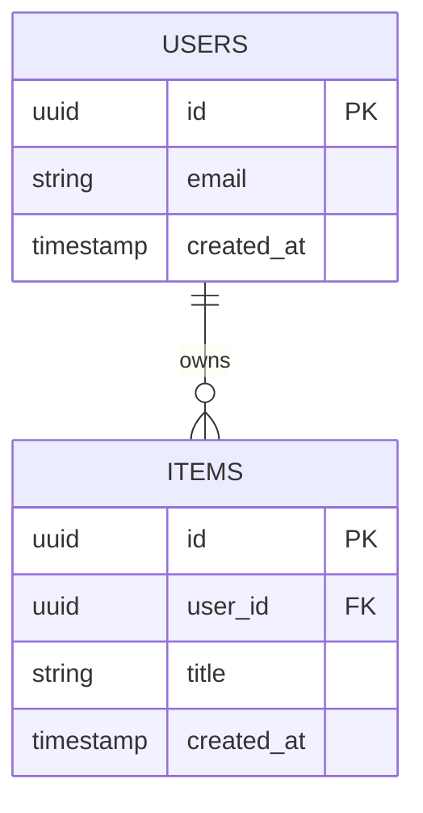
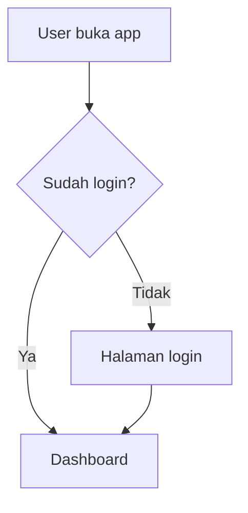
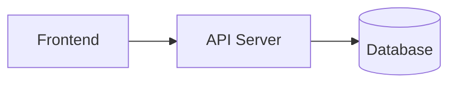

# Product Requirements Document (PRD)

**Nama Proyek:** [Nama Produk]
**Versi Dokumen:** v0.1
**Terakhir Diperbarui:** [Tanggal]
**Author:** [Nama Anda]
**Dibuat dengan:** AnyMD by Maventlabs

> Dokumen ini berpasangan dengan `AGENTS.md` (file terpisah, di-generate bersamaan). PRD.md fokus pada **apa yang dibangun**; AGENTS.md fokus pada **bagaimana cara kerja di proyek ini** (instruksi skill, konvensi, batasan). Agent sebaiknya membaca keduanya.
>
> **Panduan panjang dokumen:** Jumlah Fitur, Sub-fitur, Phase, dan Diagram di template ini **tidak dibatasi angka tetap** — sesuaikan dengan kompleksitas ide yang sebenarnya. Ide sederhana boleh cuma 3 fitur dan 3 fase; ide kompleks boleh 10+ fitur dan 8+ fase. Yang dibatasi adalah **total panjang dokumen**: target 2.000-3.000 kata, hard cap 4.000 kata. Kalau isi mendekati batas, prioritaskan kejelasan dan potong penjelasan yang berulang/tidak perlu, bukan memotong fitur yang genuinely dibutuhkan.
>
> **Kontrak companion file:** `AGENTS.md` MUST memuat rekomendasi skill otomatis, membedakan skill dari ketersediaan MCP/credential, melarang placeholder/dead interaction/simulated success, dan meminta agent melanjutkan ke phase berikutnya setelah acceptance criteria serta verification phase saat ini lulus. Pause hanya untuk credential, destructive/irreversible action, real payment, production change, atau unresolved product decision.

> **Kontrak eksekusi:** `SESSION.md` adalah ledger eksekusi yang mutable. Agent MUST membaca `prd.md`, `AGENTS.md`, dan `SESSION.md` sebelum bekerja, memperbarui `SESSION.md` setelah setiap task/phase, dan memakai evidence sebelumnya untuk menghindari pengulangan E2E yang tidak perlu.

> **Completion rule:** a task may be checked only after the complete user journey works end-to-end through its real configured provider or durable boundary, including success, failure, persistence, and verification evidence. Local adapters, isolated unit tests, and compile-only slices are implementation prework.

> **Production breadth-first:** kerjakan thin vertical slice untuk seluruh fitur `High/P0` terlebih dahulu melalui boundary nyata, lalu lakukan depth pass untuk hardening, edge case, performance, dan polish. Dependency yang blocking boleh dikerjakan lebih dulu. Jangan menyelesaikan satu fitur secara mendalam sementara fitur `High/P0` lain belum memiliki alur end-to-end yang dapat diverifikasi.

> **Tool contract:** agent MUST memakai skill dan MCP yang relevan serta tersedia untuk task. Agent MUST membedakan skill terinstal, MCP yang tersedia, credential yang valid, dan provider yang benar-benar berhasil dipanggil. Jika tool tidak tersedia, catat fallback dan jangan mengklaim tool tersebut telah digunakan.

## 0. Hierarki Eksekusi & Prioritas

Urutan otoritas dari paling tinggi ke paling rendah:

1. Product goal dan measurable outcomes
2. Fitur dan sub-fitur
3. Development phases
4. Tasks
5. Acceptance criteria
6. Verification evidence

Setiap item memakai skala yang sama:

| Label | Padanan | Arti |
|---|---|---|
| `High` | `P0` | Release-blocking; wajib selesai untuk core journey |
| `Medium` | `P1` | Penting, tetapi tidak memblokir core release |
| `Low` | `P2` | Optional enhancement atau polish |

Parent tidak boleh dicentang sebelum seluruh child yang relevan selesai dan evidence-nya tercatat di `SESSION.md`. Agent tidak boleh berhenti hanya karena unit test, mock provider, local adapter, compile, atau build lulus.

---

## 1. Product Overview

**Deskripsi Produk:**
[2-3 kalimat: apa produk ini dan apa fungsinya secara singkat]

**Problem Statement:**
[2-3 kalimat: masalah apa yang dialami user sebelum produk ini ada. Siapa yang punya masalah ini?]

**Target User:**
[Siapa yang akan memakai produk ini]

**Bahasa Output:**
[Bahasa yang dipilih user atau "ikuti bahasa input"; pertahankan Unicode tanpa silent normalization]

**Platform Support:**
[Web, Mobile, Both, atau platform lain yang diputuskan saat klarifikasi]

**Out of Scope:**
- [Fitur/hal yang sengaja TIDAK dikerjakan di versi ini]
- [Fitur/hal lain yang ditunda]

---

## 2. Unique Selling Proposition (USP)

[Apa yang membuat produk ini berbeda dari solusi/kompetitor yang sudah ada]

- **Diferensiasi utama:** [poin 1]
- **Kenapa ini penting bagi user:** [poin 2]

---

## 3. Fitur & Sub-Fitur

> Jumlah fitur **adaptif** — sesuaikan dengan cakupan ide (bisa 3, bisa 12+), jangan dipaksa pas ke angka tertentu. Prioritas pakai skala P0/P1/P2: P0 = wajib ada di rilis pertama, P1 = penting tapi bisa menyusul, P2 = bonus kalau waktu memungkinkan.

### Fitur 1: [Nama Fitur]
**Deskripsi:** [1-2 kalimat]
**Prioritas:** [P0 / P1 / P2]
**Bergantung pada:** [Nama fitur lain yang harus selesai duluan, atau "Tidak ada"]

Sub-fitur (jumlah adaptif sesuai kompleksitas fitur):
- **[Sub-fitur 1]** — [penjelasan singkat]
  - Acceptance criteria: [kondisi konkret yang menandakan sub-fitur ini selesai & benar]
- **[Sub-fitur 2]** — [penjelasan singkat]

### Fitur 2: [Nama Fitur]
**Deskripsi:** [1-2 kalimat]
**Prioritas:** [P0 / P1 / P2]
**Bergantung pada:** [rujukan fitur lain, atau "Tidak ada"]

Sub-fitur:
- **[Sub-fitur 1]** — [penjelasan singkat]

> Tambahkan Fitur N dengan format yang sama selama masih relevan dengan ide. Berhenti menambah kalau sudah mencakup seluruh scope — jangan menambah fitur cuma supaya daftar terlihat panjang.

---

## 4. Development Phases

> Jumlah fase **adaptif** — bukan angka tetap. Task yang belum selesai tetap tercantum sampai selesai, jangan dihapus, cukup dicentang. **Phase QA dan Phase Security wajib ada** (lihat di bawah), ditambah phase fitur lain sesuai kebutuhan proyek. Agent melanjutkan otomatis ke fase berikutnya setelah acceptance criteria dan verification fase saat ini lulus; gunakan pause gate hanya untuk credential, tindakan destructive/irreversible, pembayaran nyata, perubahan production, atau keputusan produk yang belum terselesaikan.

### Phase 1: [Nama Fase, misal "MVP Core"]
**Target selesai:** [tanggal opsional]
**Terkait fitur:** [rujuk ke Fitur di section 3]
**Prioritas:** [High/P0 | Medium/P1 | Low/P2]
**Mode eksekusi:** [Breadth pass | Depth pass | QA | Security]

- [ ] Task 1
  - Priority: [High/P0 | Medium/P1 | Low/P2]
  - Note: [catatan tambahan, blocker, atau keputusan teknis — opsional]
- [ ] Task 2
  - Priority: [High/P0 | Medium/P1 | Low/P2]
- [ ] Task 3
  - Priority: [High/P0 | Medium/P1 | Low/P2]

**Anggap fase ini selesai kalau:** [1 kalimat kondisi konkret] dan setiap task memenuhi Completion rule melalui provider atau durable boundary yang benar-benar dikonfigurasi.

### Phase 2: [Nama Fase]
**Terkait fitur:** [rujukan fitur]

- [ ] Task 1
- [ ] Task 2

> Tambahkan Phase N sesuai kebutuhan proyek (fitur besar biasanya butuh fase sendiri). Dua phase berikut **wajib ada** sebelum phase rilis final, di posisi manapun yang masuk akal secara urutan kerja (biasanya menjelang akhir):

### Phase QA: Pengujian & Verifikasi
**Terkait fitur:** Seluruh fitur P0

- [ ] Unit test untuk logic inti (business logic, bukan UI)
- [ ] Integration test untuk endpoint API utama
- [ ] Contract test untuk provider dan boundary durable yang dipakai fitur P0
- [ ] E2E test alur end-to-end pada production code path (happy path + failure + persistence + minimal 1 edge case per fitur P0)
- [ ] Verifikasi acceptance criteria setiap sub-fitur P0 terpenuhi
- [ ] Test responsif dasar (mobile & desktop) jika ada UI
- [ ] Verifikasi setiap kontrol dan interaksi benar-benar bekerja end-to-end; tidak ada decorative placeholder, dead button, fake interaction, atau simulated success
- [ ] Catat commit, environment, provider, MCP/skills, command, timestamp, dan evidence di `SESSION.md`

**Anggap fase ini selesai kalau:** Seluruh fitur P0 lolos acceptance criteria dan Completion rule, tidak ada bug blocking yang diketahui, serta evidence E2E/persistence sudah dicatat.

### Phase Security: Keamanan Aplikasi
**Terkait fitur:** Seluruh fitur yang menangani input user, auth, atau data

- [ ] Validasi & sanitasi seluruh input user (cegah injection, XSS jika web-based)
- [ ] Review penyimpanan credential/API key (harus di environment variable, tidak hardcoded/tidak ter-commit)
- [ ] Rate limiting pada endpoint publik yang rawan disalahgunakan
- [ ] Review permission/akses data (user hanya bisa akses data miliknya sendiri, jika relevan)
- [ ] Cek dependency/library pihak ketiga dari kerentanan yang diketahui
- [ ] Review analytics consent, identity hashing, event retention, dan akses metric

**Anggap fase ini selesai kalau:** Tidak ada credential yang ter-expose, input tervalidasi, dan akses data sesuai kepemilikan.

---

## 5. Tech Stack

| Layer | Teknologi | Alasan Pemilihan |
|---|---|---|
| Frontend | | |
| Backend | | |
| Database | | |
| Auth | | |
| Hosting/Deploy | | |
| Lainnya | | |

---

## 5A. Visual Direction (Preset Terbatas)

> Section ini **bukan** design system lengkap. Gunakan tepat satu preset yang dipilih user dan pertahankan semantic roles-nya. Jangan menyalin brand name, logo, proprietary asset, atau distinctive identity dari sumber inspirasi.

| ID | Nama | Mode | Display / Body / Mono | Canvas / Surface | Primary / Accent |
|---|---|---|---|---|---|
| `precision-blue` | Precision Blue | Light | Inter / Inter / IBM Plex Mono | `#f5f5f7` / `#ffffff` | `#2f6df5` / `#0071e3` |
| `signal-editorial` | Signal Editorial | Light | Oswald / DM Sans / IBM Plex Mono | `#f4f3ef` / `#ffffff` | `#e35b32` / `#524ae9` |
| `playful-lime` | Playful Lime | Light | Nunito / Nunito Sans / IBM Plex Mono | `#f7fff1` / `#ffffff` | `#58cc02` / `#1cb0f6` |
| `signal-black` | Signal Black | Dark | Space Grotesk / Inter / IBM Plex Mono | `#090909` / `#141414` | `#fc1c46` / `#ff718d` |
| `cobalt-terminal` | Cobalt Terminal | Dark | Figtree / Inter / IBM Plex Mono | `#0e111b` / `#121827` | `#2862d7` / `#63a2ff` |
| `violet-ledger` | Violet Ledger | Dark | Lora / Inter / IBM Plex Mono | `#0f1011` / `#191a1d` | `#847dff` / `#00b3dd` |

### Semantic Roles

Output MUST menyebut nilai preset terpilih untuk `canvas`, `surface`, `text`, `mutedText`, `primary`, `primaryText`, `border`, dan `accent`, beserta display/body/monospace font.

### Batasan Eksplisit (MUST NOT)

Agent **MUST NOT** memakai gradient dekoratif tanpa fungsi; ikon campur-gaya/tidak profesional; kartu seragam tanpa hierarki dengan shadow generik yang sama di semua tempat; label eyebrow ALL-CAPS di setiap heading; motion otomatis di setiap elemen; atau warna di luar semantic roles tanpa alasan aksesibilitas/fungsional yang eksplisit.

---

## 6. Database Schema Diagram

> Mermaid — dirender otomatis. Jumlah entitas/tabel **adaptif** sesuai kompleksitas data proyek, bukan dipaksa mengikuti contoh di bawah.



[Ganti dengan skema aktual proyek. Catat kalau ada data sensitif yang perlu perhatian khusus.]

---

## 7. API Documentation

> Jumlah endpoint group **adaptif** sesuai fitur — bisa 2 group, bisa 8 group.

### [Nama Endpoint Group, misal "Auth"]

| Method | Endpoint | Deskripsi | Request Body | Response |
|---|---|---|---|---|
| POST | `/api/auth/login` | Login user | `{ email, password }` | `{ token, user }` |

> Tambahkan Endpoint Group lain sesuai kebutuhan fitur.

---

## 8. Additional Diagrams

> Mermaid, adaptif. Minimal User Flow dan Architecture Diagram; tambahkan sequence diagram atau diagram lain kalau proyek butuh (misal alur pembayaran, alur real-time).

### User Flow



### Architecture Diagram



[Tambahkan diagram lain sesuai kebutuhan proyek.]

---

## 10. Observability, Testing & Product Metrics

> Section ini menjelaskan cara mengukur apakah website benar-benar dipakai dan bekerja. Local execution hanya memvalidasi instrumentasi dan query dengan fixture sintetis; MAU/DAU nyata memerlukan deployment ke environment dengan durable event store.

### Testing Architecture

- **Unit:** validasi input, business rules, metric definitions, privacy filters, dan pure functions.
- **Integration:** route/API, database writes, queue, auth/session, webhook, dan event collector.
- **Contract:** format provider, MCP response, skills contract, webhook payload, dan generated document schema.
- **E2E:** user journey nyata melalui production code path dengan success, failure, persistence, dan recovery.
- **Smoke:** configured provider dan durable boundary benar-benar reachable pada deployed environment.
- **Release evidence:** catat commit, environment, tool/skill/MCP, command, result, dan timestamp di `SESSION.md`.

### Event Contract

| Event | Kapan dicatat | Properties yang diperbolehkan |
|---|---|---|
| `page_view` | Halaman dibuka setelah consent | `route`, `device_class`, `referrer_class` |
| `signup_completed` | Signup berhasil | `auth_method` |
| `generation_started` | Request generation diterima | `feature_count`, `skill_count` |
| `generation_completed` | Bundle tervalidasi dan tersedia | `duration_ms`, `document_count` |
| `checkout_started` | Checkout session berhasil dibuat | `package_id` |
| `feedback_submitted` | Feedback berhasil disimpan | `rating` |

Jangan kirim raw IP, prompt, document content, query, email, atau PII yang tidak diperlukan. Event hanya boleh dikumpulkan setelah consent eksplisit.

### Metric Definitions

- **DAU:** `COUNT(DISTINCT actor_key)` untuk active events pada satu hari UTC.
- **MAU:** `COUNT(DISTINCT actor_key)` untuk active events pada rolling 30 hari.
- **Traffic:** total `page_view`, unique `actor_key`, route distribution, dan referrer class.
- **Activation:** actor yang menyelesaikan `generation_completed` dibagi actor yang memulai flow.
- **Generation reliability:** success rate, failure rate, retry rate, dan p95 duration.
- **Payment funnel:** checkout started, completed webhook, credited purchase, dan failed/recovered payment.

`actor_key` harus berupa authenticated user ID atau salted anonymous ID. Raw IP tidak boleh menjadi identity metric.

### Local vs Deployed Verification

- Local: jalankan schema validation, event collector tests, metric query tests, dan synthetic fixtures.
- Staging/production: verifikasi event benar-benar masuk ke durable store dan query menghasilkan metric.
- Synthetic local traffic tidak boleh dilaporkan sebagai MAU/DAU production.
- Catat timezone, rolling window, retention policy, consent state, dan data source bersama hasil metric.
- Default retention: 90 hari, dapat diubah melalui keputusan produk dan konfigurasi deployment.

**Anggap observability selesai kalau:** event schema tervalidasi, consent/privacy checks lulus, event masuk ke durable boundary, metric query dapat direproduksi, dan deployed smoke evidence tercatat.

---

## 11. Prompt Inisiasi untuk Agent

> Bukan file terpisah — teks ini di-copy langsung ke AI coding agent. Dijaga pendek dan padat.

```
Baca prd.md dan AGENTS.md di root proyek ini, lalu mulai kerjakan
Phase 1 sesuai daftar task di prd.md. Baca SESSION.md sebelum mulai dan
perbarui setelah setiap task atau phase. Ikuti instruksi skill di
AGENTS.md (MUST digunakan jika terinstal dan relevan) dan gunakan MCP
yang relevan jika tersedia; laporkan tool yang benar-benar dipakai.
Kerjakan production breadth-first melalui provider dan durable boundary
nyata. Jangan mencentang task berdasarkan local adapter, mock, unit test,
compile, atau build saja. Setelah Completion rule, acceptance criteria,
dan verification phase saat ini lulus, lanjutkan otomatis ke phase
berikutnya. Jangan mengulang E2E yang sudah dibuktikan kecuali source,
config, provider, environment, failure, atau release gate berubah.
Pastikan Phase QA, Phase Security, dan Observability dikerjakan sebelum
proyek dianggap selesai.
```

---

## Changelog

| Tanggal | Perubahan |
|---|---|
| 18 September 2026 | Menambahkan kontrak bahasa/Unicode, enam preset tema, functional-only output, rekomendasi skill otomatis, dan auto-continue antar-phase. |
| 22 September 2026 | Menambahkan hierarchy eksekusi, priority mapping, production breadth-first, Completion rule, MCP/skills evidence, SESSION.md contract, dan observability/MAU/DAU requirements. |
| [tanggal] | Draft awal |
