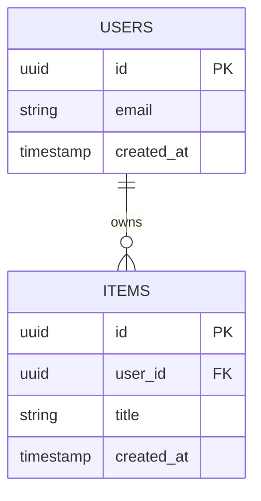
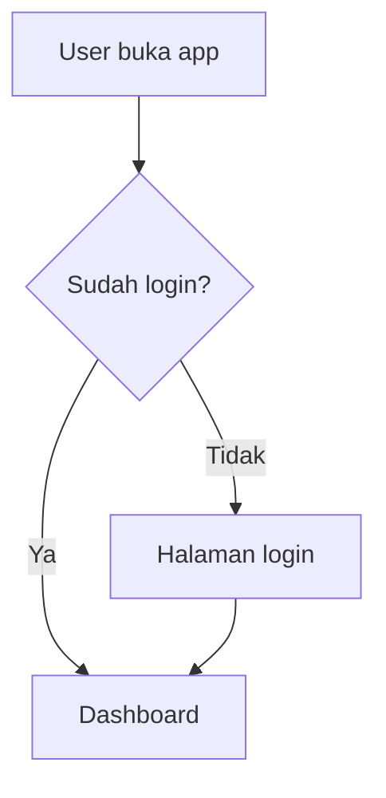
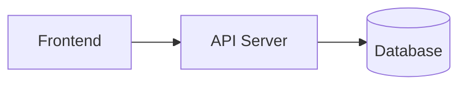

# Product Requirements Document (PRD)

**Nama Proyek:** [Nama Produk]
**Versi Dokumen:** v0.1
**Terakhir Diperbarui:** [Tanggal]
**Author:** [Nama Anda]
**Dibuat dengan:** AnyMD by Maventlabs

> Dokumen ini berpasangan dengan `AGENTS.md` (file terpisah, di-generate bersamaan). PRD.md fokus pada **apa yang dibangun**; AGENTS.md fokus pada **bagaimana cara kerja di proyek ini** (instruksi skill, konvensi, batasan). Agent sebaiknya membaca keduanya.
>
> **Panduan panjang dokumen:** Jumlah Fitur, Sub-fitur, Phase, dan Diagram di template ini **tidak dibatasi angka tetap** — sesuaikan dengan kompleksitas ide yang sebenarnya. Ide sederhana boleh cuma 3 fitur dan 3 fase; ide kompleks boleh 10+ fitur dan 8+ fase. Yang dibatasi adalah **total panjang dokumen**: target 2.000-3.000 kata, hard cap 4.000 kata. Kalau isi mendekati batas, prioritaskan kejelasan dan potong penjelasan yang berulang/tidak perlu, bukan memotong fitur yang genuinely dibutuhkan.
>
> **Kontrak companion file:** `AGENTS.md` MUST memuat rekomendasi skill otomatis, membedakan skill dari ketersediaan MCP/credential, melarang placeholder/dead interaction/simulated success, dan meminta agent melanjutkan ke phase berikutnya setelah acceptance criteria serta verification phase saat ini lulus. Pause hanya untuk credential, destructive/irreversible action, real payment, production change, atau unresolved product decision.

---

## 1. Product Overview

**Deskripsi Produk:**
[2-3 kalimat: apa produk ini dan apa fungsinya secara singkat]

**Problem Statement:**
[2-3 kalimat: masalah apa yang dialami user sebelum produk ini ada. Siapa yang punya masalah ini?]

**Target User:**
[Siapa yang akan memakai produk ini]

**Bahasa Output:**
[Bahasa yang dipilih user atau "ikuti bahasa input"; pertahankan Unicode tanpa silent normalization]

**Platform Support:**
[Web, Mobile, Both, atau platform lain yang diputuskan saat klarifikasi]

**Out of Scope:**
- [Fitur/hal yang sengaja TIDAK dikerjakan di versi ini]
- [Fitur/hal lain yang ditunda]

---

## 2. Unique Selling Proposition (USP)

[Apa yang membuat produk ini berbeda dari solusi/kompetitor yang sudah ada]

- **Diferensiasi utama:** [poin 1]
- **Kenapa ini penting bagi user:** [poin 2]

---

## 3. Fitur & Sub-Fitur

> Jumlah fitur **adaptif** — sesuaikan dengan cakupan ide (bisa 3, bisa 12+), jangan dipaksa pas ke angka tertentu. Prioritas pakai skala P0/P1/P2: P0 = wajib ada di rilis pertama, P1 = penting tapi bisa menyusul, P2 = bonus kalau waktu memungkinkan.

### Fitur 1: [Nama Fitur]
**Deskripsi:** [1-2 kalimat]
**Prioritas:** [P0 / P1 / P2]
**Bergantung pada:** [Nama fitur lain yang harus selesai duluan, atau "Tidak ada"]

Sub-fitur (jumlah adaptif sesuai kompleksitas fitur):
- **[Sub-fitur 1]** — [penjelasan singkat]
  - Acceptance criteria: [kondisi konkret yang menandakan sub-fitur ini selesai & benar]
- **[Sub-fitur 2]** — [penjelasan singkat]

### Fitur 2: [Nama Fitur]
**Deskripsi:** [1-2 kalimat]
**Prioritas:** [P0 / P1 / P2]
**Bergantung pada:** [rujukan fitur lain, atau "Tidak ada"]

Sub-fitur:
- **[Sub-fitur 1]** — [penjelasan singkat]

> Tambahkan Fitur N dengan format yang sama selama masih relevan dengan ide. Berhenti menambah kalau sudah mencakup seluruh scope — jangan menambah fitur cuma supaya daftar terlihat panjang.

---

## 4. Development Phases

> Jumlah fase **adaptif** — bukan angka tetap. Task yang belum selesai tetap tercantum sampai selesai, jangan dihapus, cukup dicentang. **Phase QA dan Phase Security wajib ada** (lihat di bawah), ditambah phase fitur lain sesuai kebutuhan proyek. Agent melanjutkan otomatis ke fase berikutnya setelah acceptance criteria dan verification fase saat ini lulus; gunakan pause gate hanya untuk credential, tindakan destructive/irreversible, pembayaran nyata, perubahan production, atau keputusan produk yang belum terselesaikan.

### Phase 1: [Nama Fase, misal "MVP Core"]
**Target selesai:** [tanggal opsional]
**Terkait fitur:** [rujuk ke Fitur di section 3]

- [ ] Task 1
  - Note: [catatan tambahan, blocker, atau keputusan teknis — opsional]
- [ ] Task 2
- [ ] Task 3

**Anggap fase ini selesai kalau:** [1 kalimat kondisi konkret]

### Phase 2: [Nama Fase]
**Terkait fitur:** [rujukan fitur]

- [ ] Task 1
- [ ] Task 2

> Tambahkan Phase N sesuai kebutuhan proyek (fitur besar biasanya butuh fase sendiri). Dua phase berikut **wajib ada** sebelum phase rilis final, di posisi manapun yang masuk akal secara urutan kerja (biasanya menjelang akhir):

### Phase QA: Pengujian & Verifikasi
**Terkait fitur:** Seluruh fitur P0

- [ ] Unit test untuk logic inti (business logic, bukan UI)
- [ ] Integration test untuk endpoint API utama
- [ ] Manual test alur end-to-end (happy path + minimal 1 edge case per fitur P0)
- [ ] Verifikasi acceptance criteria setiap sub-fitur P0 terpenuhi
- [ ] Test responsif dasar (mobile & desktop) jika ada UI
- [ ] Verifikasi setiap kontrol dan interaksi benar-benar bekerja end-to-end; tidak ada decorative placeholder, dead button, fake interaction, atau simulated success

**Anggap fase ini selesai kalau:** Seluruh fitur P0 lolos acceptance criteria dan tidak ada bug blocking yang diketahui.

### Phase Security: Keamanan Aplikasi
**Terkait fitur:** Seluruh fitur yang menangani input user, auth, atau data

- [ ] Validasi & sanitasi seluruh input user (cegah injection, XSS jika web-based)
- [ ] Review penyimpanan credential/API key (harus di environment variable, tidak hardcoded/tidak ter-commit)
- [ ] Rate limiting pada endpoint publik yang rawan disalahgunakan
- [ ] Review permission/akses data (user hanya bisa akses data miliknya sendiri, jika relevan)
- [ ] Cek dependency/library pihak ketiga dari kerentanan yang diketahui

**Anggap fase ini selesai kalau:** Tidak ada credential yang ter-expose, input tervalidasi, dan akses data sesuai kepemilikan.

---

## 5. Tech Stack

| Layer | Teknologi | Alasan Pemilihan |
|---|---|---|
| Frontend | | |
| Backend | | |
| Database | | |
| Auth | | |
| Hosting/Deploy | | |
| Lainnya | | |

---

## 5A. Visual Direction (Preset Terbatas)

> Section ini **bukan** design system lengkap. Gunakan tepat satu preset yang dipilih user dan pertahankan semantic roles-nya. Jangan menyalin brand name, logo, proprietary asset, atau distinctive identity dari sumber inspirasi.

| ID | Nama | Mode | Display / Body / Mono | Canvas / Surface | Primary / Accent |
|---|---|---|---|---|---|
| `precision-blue` | Precision Blue | Light | Inter / Inter / IBM Plex Mono | `#f5f5f7` / `#ffffff` | `#2f6df5` / `#0071e3` |
| `signal-editorial` | Signal Editorial | Light | Oswald / DM Sans / IBM Plex Mono | `#f4f3ef` / `#ffffff` | `#e35b32` / `#524ae9` |
| `playful-lime` | Playful Lime | Light | Nunito / Nunito Sans / IBM Plex Mono | `#f7fff1` / `#ffffff` | `#58cc02` / `#1cb0f6` |
| `signal-black` | Signal Black | Dark | Space Grotesk / Inter / IBM Plex Mono | `#090909` / `#141414` | `#fc1c46` / `#ff718d` |
| `cobalt-terminal` | Cobalt Terminal | Dark | Figtree / Inter / IBM Plex Mono | `#0e111b` / `#121827` | `#2862d7` / `#63a2ff` |
| `violet-ledger` | Violet Ledger | Dark | Lora / Inter / IBM Plex Mono | `#0f1011` / `#191a1d` | `#847dff` / `#00b3dd` |

### Semantic Roles

Output MUST menyebut nilai preset terpilih untuk `canvas`, `surface`, `text`, `mutedText`, `primary`, `primaryText`, `border`, dan `accent`, beserta display/body/monospace font.

### Batasan Eksplisit (MUST NOT)

Agent **MUST NOT** memakai gradient dekoratif tanpa fungsi; ikon campur-gaya/tidak profesional; kartu seragam tanpa hierarki dengan shadow generik yang sama di semua tempat; label eyebrow ALL-CAPS di setiap heading; motion otomatis di setiap elemen; atau warna di luar semantic roles tanpa alasan aksesibilitas/fungsional yang eksplisit.

---

## 6. Database Schema Diagram

> Mermaid — dirender otomatis. Jumlah entitas/tabel **adaptif** sesuai kompleksitas data proyek, bukan dipaksa mengikuti contoh di bawah.



[Ganti dengan skema aktual proyek. Catat kalau ada data sensitif yang perlu perhatian khusus.]

---

## 7. API Documentation

> Jumlah endpoint group **adaptif** sesuai fitur — bisa 2 group, bisa 8 group.

### [Nama Endpoint Group, misal "Auth"]

| Method | Endpoint | Deskripsi | Request Body | Response |
|---|---|---|---|---|
| POST | `/api/auth/login` | Login user | `{ email, password }` | `{ token, user }` |

> Tambahkan Endpoint Group lain sesuai kebutuhan fitur.

---

## 8. Additional Diagrams

> Mermaid, adaptif. Minimal User Flow dan Architecture Diagram; tambahkan sequence diagram atau diagram lain kalau proyek butuh (misal alur pembayaran, alur real-time).

### User Flow



### Architecture Diagram



[Tambahkan diagram lain sesuai kebutuhan proyek.]

---

## 9. Prompt Inisiasi untuk Agent

> Bukan file terpisah — teks ini di-copy langsung ke AI coding agent. Dijaga pendek dan padat.

```
Baca prd.md dan AGENTS.md di root proyek ini, lalu mulai kerjakan
Phase 1 sesuai daftar task di prd.md. Ikuti instruksi skill di
AGENTS.md (MUST digunakan jika terinstal dan relevan), dan laporkan
mana yang akan dipakai. Implementasikan hanya perilaku yang bekerja
end-to-end. Setelah acceptance criteria dan verification suatu phase
lulus, lanjutkan otomatis ke phase berikutnya. Pastikan Phase QA dan
Phase Security dikerjakan sebelum proyek dianggap selesai.
```

---

## Changelog

| Tanggal | Perubahan |
|---|---|
| 18 September 2026 | Menambahkan kontrak bahasa/Unicode, enam preset tema, functional-only output, rekomendasi skill otomatis, dan auto-continue antar-phase. |
| [tanggal] | Draft awal |
