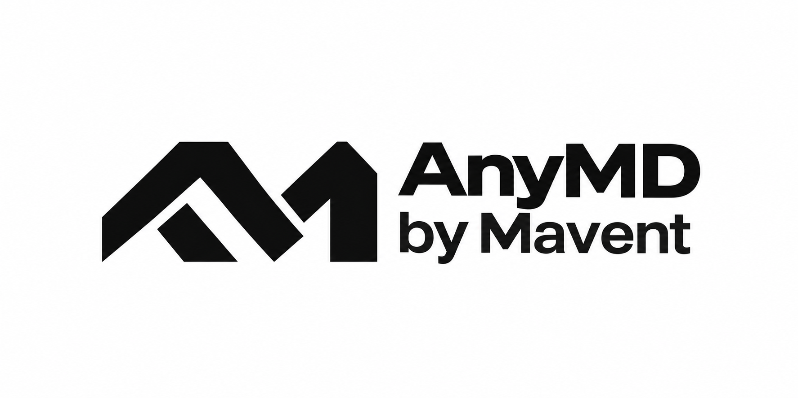
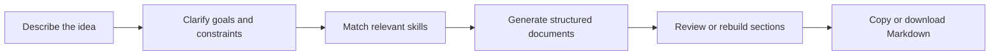
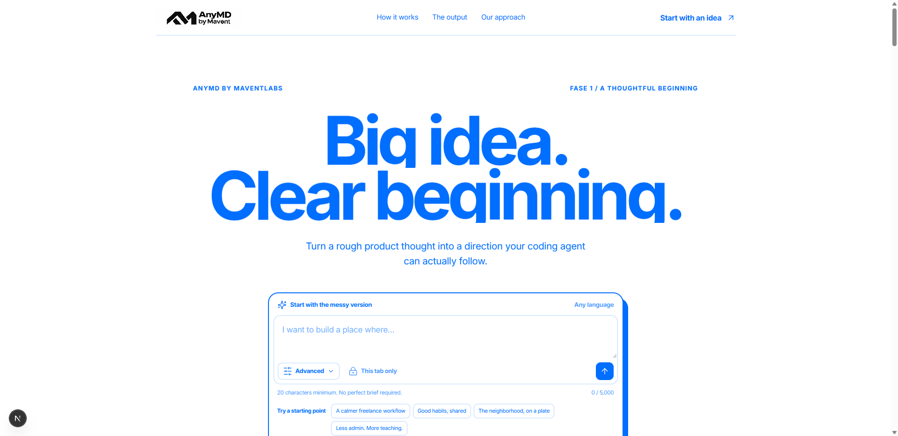
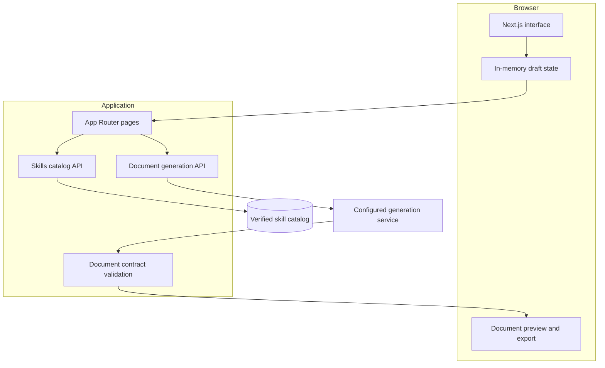

<div align="center">
  

  <p><strong>Turn a rough product idea into a clear brief and agent-ready Markdown.</strong></p>

  <p>
    
    
    
    
    
  </p>
</div>

## What is AnyMD?

AnyMD is a guided product-definition workspace. It helps turn an early idea into
two practical files:

- `prd.md` describes the product, scope, priorities, architecture, and delivery plan.
- `AGENTS.md` tells coding agents how to work on the project safely and consistently.

Instead of starting with a blank document, users move through a focused sequence
of clarification, skill matching, generation, review, and export.

## Product Flow



## Highlights

- Guided clarification with conditional questions.
- Automatic skill recommendations from a structured catalog.
- Structured and raw Markdown previews.
- Focused section rebuilds without replacing the whole document.
- One-click copy and local Markdown downloads.
- Responsive layouts tested on desktop and mobile Chromium.
- Accessible navigation, status feedback, and keyboard interactions.
- Strict document validation before generated content reaches the UI.



## Architecture



The browser keeps the active draft in memory. Server routes handle catalog access
and document generation, while a strict contract validates every generated bundle
before it is returned to the interface.

## Local Development

### Requirements

- Node.js 20 or newer
- npm

### Start the app

```bash
npm install
npm run dev
```

Open [http://localhost:3000](http://localhost:3000).

## Quality Gates

```bash
npm test
npm run lint
npm run typecheck
npm run build
npm run test:e2e
```

| Command | Purpose |
|---|---|
| `npm test` | Run unit and route-handler tests |
| `npm run lint` | Check code quality with ESLint |
| `npm run typecheck` | Generate route types and run TypeScript checks |
| `npm run build` | Create a production build |
| `npm run test:e2e` | Test critical desktop and mobile journeys |

## Project Structure

```text
anymd/
├── app/              # Pages, metadata, and route handlers
├── components/       # Product journey and reusable interface pieces
├── data/             # Verified fallback catalog data
├── e2e/              # Browser journey tests
├── lib/              # Validation, generation, and domain logic
├── public/           # Brand and interface assets
└── tests/            # Unit and API tests
```

## Security

- Generated Markdown is rendered as text rather than injected as raw HTML.
- User-provided content is treated as untrusted input.
- Public errors are sanitized before they reach the browser.
- Content Security Policy and browser hardening headers are enabled.
- Sensitive local files are excluded from Git.

## Contributing

Read [CONTRIBUTING.md](CONTRIBUTING.md) before opening a pull request. Keep changes
small, include tests for behavior changes, and run every quality gate above.

## License

No open-source license has been selected yet. Until a license file is added, no
license rights are granted beyond applicable law.
